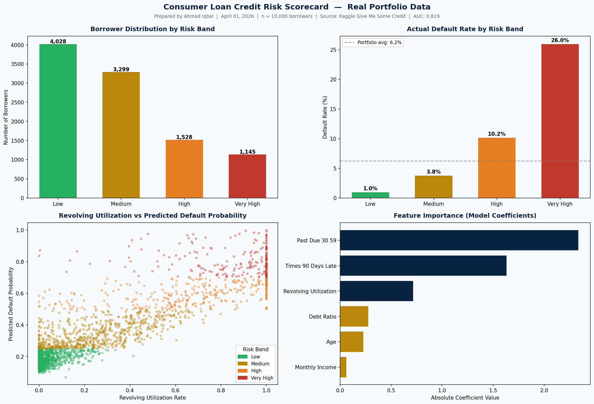

# Consumer Loan Credit Risk Scorecard

A machine learning tool that predicts borrower default probability 
and assigns risk bands using real consumer credit data.

## Overview

Built using 10,000 real borrower records from the Kaggle 
Give Me Some Credit dataset. Applies logistic regression to 
predict the probability of serious delinquency and segments 
borrowers into four risk bands: Low, Medium, High, and Very High.

## Dashboard Output



## What It Does

- Loads and cleans real consumer credit data
- Trains a logistic regression model with class balancing
- Assigns each borrower a predicted default probability
- Segments borrowers into risk bands based on probability thresholds
- Generates a four-panel dashboard showing distribution, default 
  rates, feature importance, and utilization vs default probability
- Optionally exports a formatted analyst memo to a text file

## Model Performance

- AUC-ROC: 0.819
- Top predictors: Past Due 30-59 Days, Times 90 Days Late, 
  Revolving Utilization
- Class-balanced logistic regression to handle default rate imbalance

## Tech Stack

- Python
- Pandas — data cleaning and aggregation
- Scikit-learn — logistic regression, train/test split, scaling
- Matplotlib — dashboard visualization
- Source: Kaggle Give Me Some Credit dataset

## How to Run

1. Download the dataset from 
   kaggle.com/c/GiveMeSomeCredit/data
2. Place `cs-training.csv` in the project folder
3. Install dependencies:
```
   pip install pandas scikit-learn matplotlib
```
4. Run:
```
   python credit_risk.py
```
5. Close the chart window when done
6. Type `y` when prompted to save an analyst memo

## Skills Demonstrated

- Credit risk modeling and probability of default estimation
- Feature importance analysis and risk band segmentation
- Data cleaning and handling class imbalance
- Financial data visualization and analyst memo writing